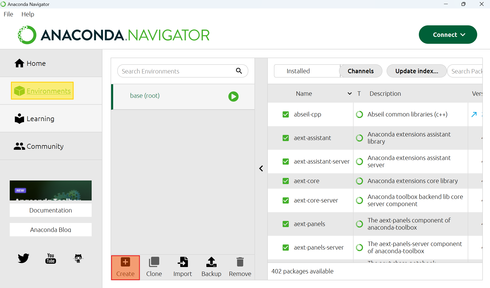
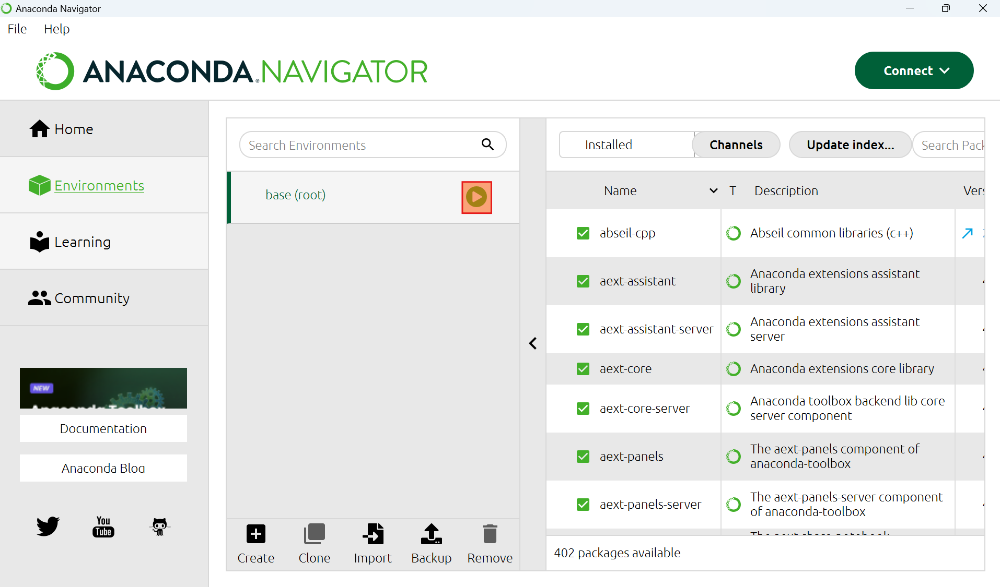

# Installation Tutorial
This is a step-by-step walkthrough for users who aren't as familiar with using R and Python

##R Installation
1. Navigate to [https://cran.r-project.org/](https://cran.r-project.org/) and click the link to download R for your platform.
2. Once you have selected and downloaded your desired version, navigate to the downloaded .exe file and execute it.
3. Follow the on-screen instructions to set up R.

##R Configuration
1. Once installation is complete, open R.
2. In the console, paste and run the following:
```bash
install.packages('OpenSpecy', repos='http://cran.us.r-project.org')
```
3. Once OpenSpecy and its dependencies are installed, run the following code in the console one line at a time:
```bash
library(OpenSpecy)
get_lib()
```
   * This will download the 7 spectral libraries that are available in OpenSpecy. These libraries will be kept on your hard drive, so after initial installation, this only needs to be done when the libraries are updated.
4. Run this line:
```bash
R.home()
```
   * Copy and paste the outputted path somewhere. This will be needed later.
5. Exit out of R. You will be prompted with "Save workspace image?" This is to save any user-defined objects. Because we have not defined anything, it does not matter if you select "yes" or "no"

##Anaconda Installation and Setup
[Anaconda Navigator](https://www.anaconda.com/download) will be used for the purposes of this tutorial.
1. If it is not already installed, download and install Anaconda from [https://www.anaconda.com/download](https://www.anaconda.com/download)
2. Open Anaconda and navigate to the Environments tab on the left side, and then select the Create button from the menu at the bottom of the screen.

3. Name the environment as you choose.

##Python Setup
1. In Anaconda Navigator, click the arrow button next to the environment you created and select "Open Terminal"

   * Note that the environment in this screenshot is the base (root) environment. Please be sure to open the environment you created, not base
2. In the terminal, run the following:
```bash
pip install openspecy-python-interface
```
   * This will install this package as well as its dependencies (pandas, openpyxl, and rpy2)
3. Exit out of the terminal
4. Open Python in your preferred application through Anaconda. Spyder is highly recommended

##Python Usage
